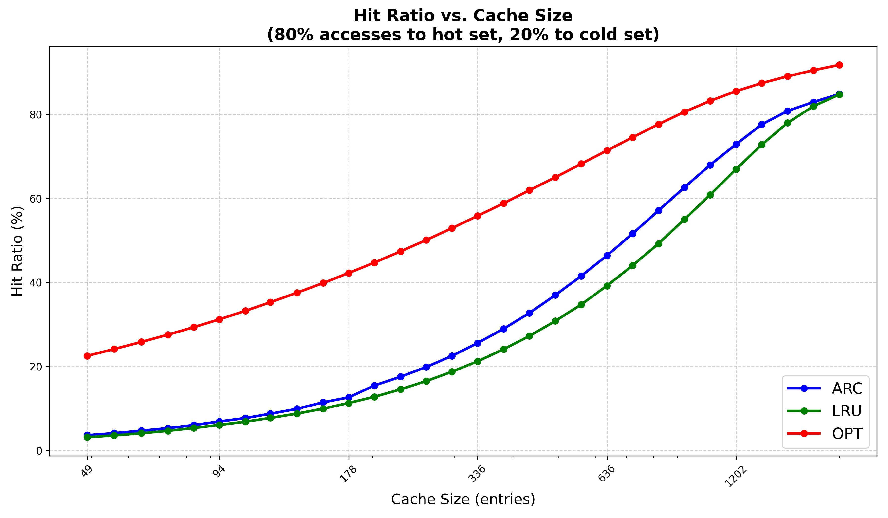

# Cache Comparison Project

Этот проект реализует и сравнивает три типа кэширования: **LRU**, **Optimal (Belady)** и **ARC**.  
Он включает визуализацию сравнения **hit ratio** в зависимости от размера кэша для данных трёх алгоритмов.

---

## Содержание

- `src/` —  общий `main.cpp`.
- `include/` — заголовочные файлы кэшей (шаблонные библиотеки `.hpp`) и имитация медленной загрузки страницы.
- `tests/unit/` — модульные тесты.
- `graph/` — скрипт на Python для построения графика со сравнением работы алгоритмов.


---

## Реализованные кэши

1. **LRU (Least Recently Used)**  
   Вытесняет наименее недавно используемый элемент.

2. **Optimal (Belady)**  
   Использует знание будущих обращений для минимизации промахов.

3. **ARC (Adaptive Replacement Cache)**  
   Адаптивно балансирует между недавно используемыми и часто используемыми страницами.
   - Использует четыре списка: T1, T2, B1, B2.
   - `T1` и `T2` хранят реально находящиеся в кэше элементы.
   - `B1` и `B2` хранят недавние вытесненные элементы.
   - Параметр `p` регулирует размер T1/T2 для адаптации к рабочей нагрузке.
   - Подробнее алгоритм описан в оригинальной статье: [ARC: A Self‑Tuning, Low Overhead Replacement Cache](https://www.cs.cmu.edu/~natassa/courses/15-721/papers/arcfast.pdf) 
---

## Сборка

Проект использует **CMake**.  
Для сборки:

```bash
mkdir -p build
cd build
cmake ..
make
```

## Запуск

```bash
python3 graph/graph_comparison.py
```

## Результаты сравнения


